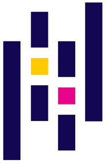
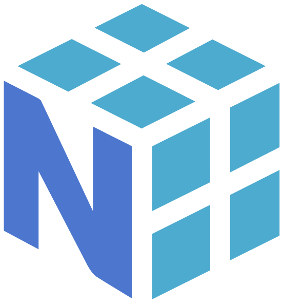
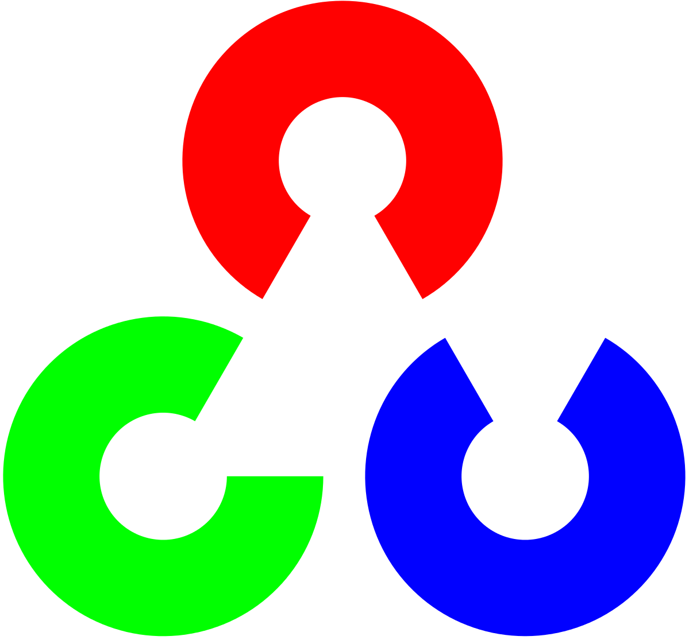
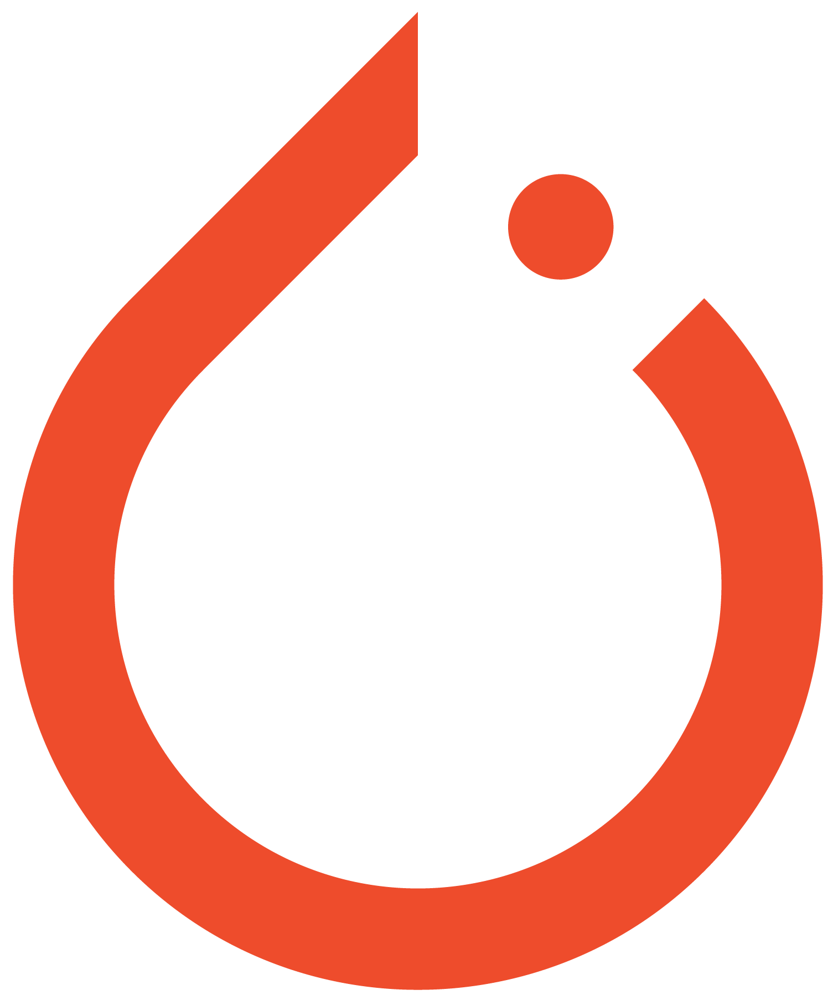
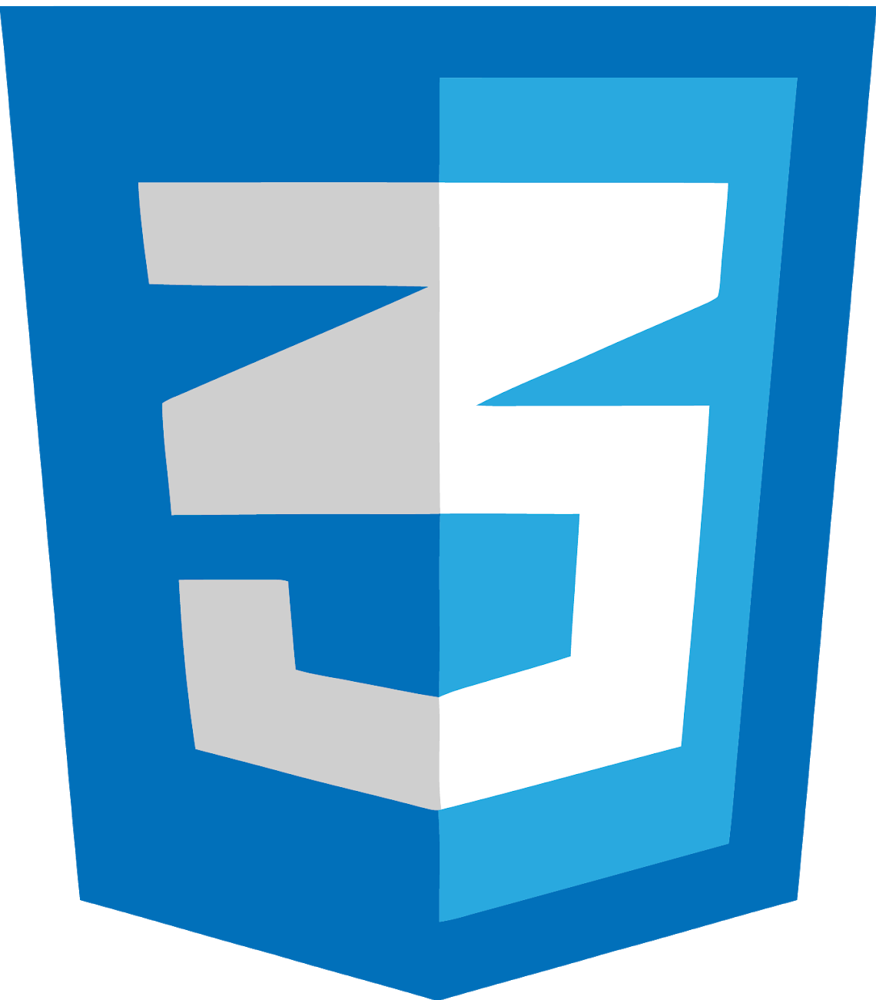
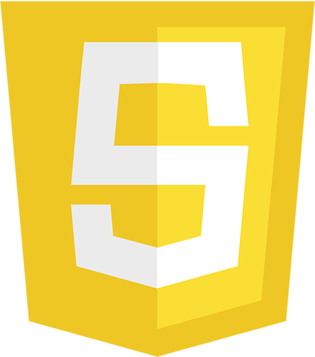

### Hi there, I'm Luan Gonçalves - LuanAGoncalves

<!--
**LuanAGoncalves/LuanAGoncalves** is a ✨ _special_ ✨ repository because its `README.md` (this file) appears on your GitHub profile.

Here are some ideas to get you started:

- 🔭 I’m currently working on ...
- 🌱 I’m currently learning ...
- 👯 I’m looking to collaborate on ...
- 🤔 I’m looking for help with ...
- 💬 Ask me about ...
- 📫 How to reach me: ...
- 😄 Pronouns: ...
- ⚡ Fun fact: ...
-->

- I'm a PhD student in Electrical Engineer by Federal University of Pará
- I'm bloody interested in machine learning and its different application (like Computer Vision, Telecommunications, etc.)
- I'm a Data Scientist

### Connect with me:
[][website]
[][github]
[][linkedin]
[][twitter]

 
 

### Languages and Tools:

 
 
 

